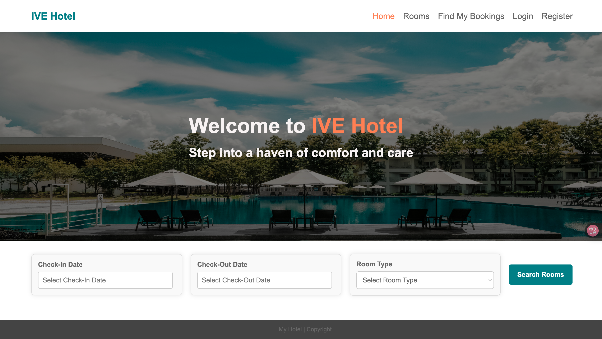
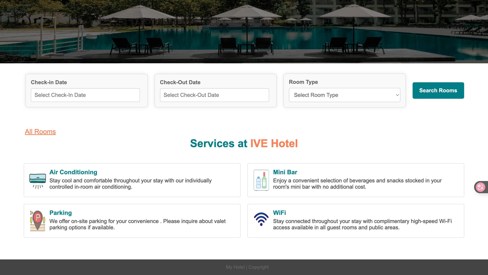
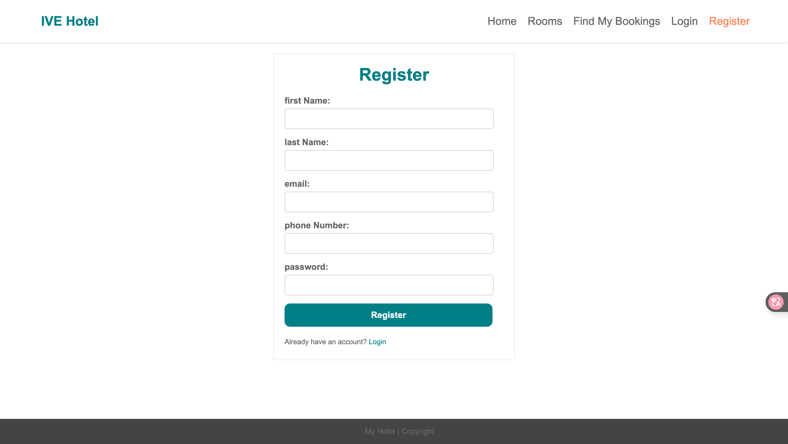
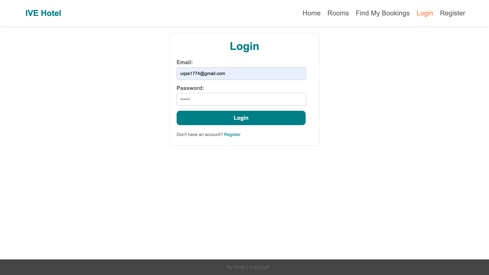
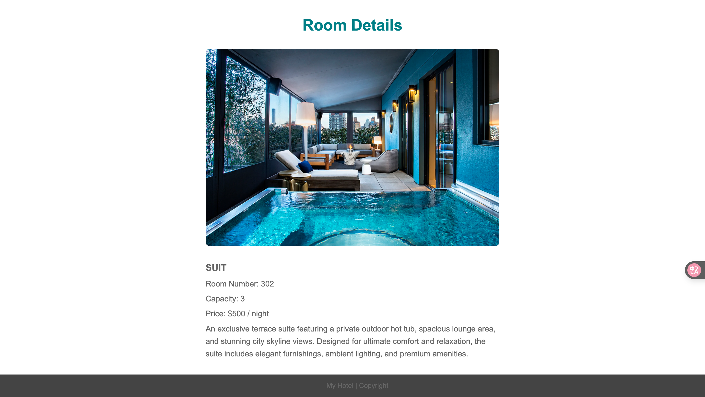
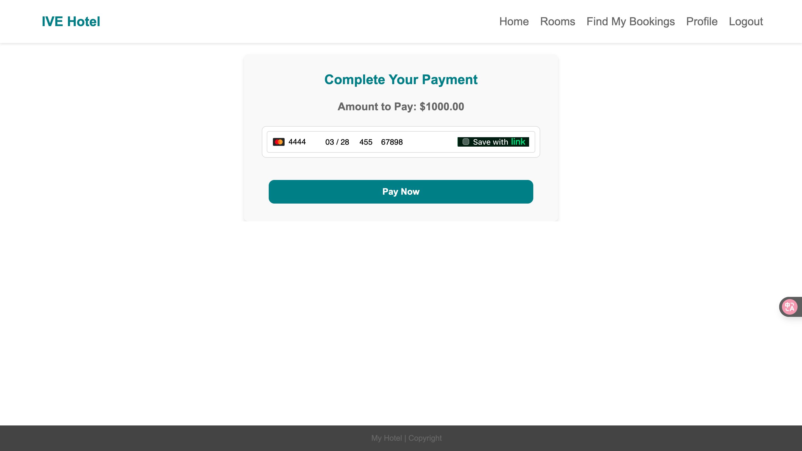
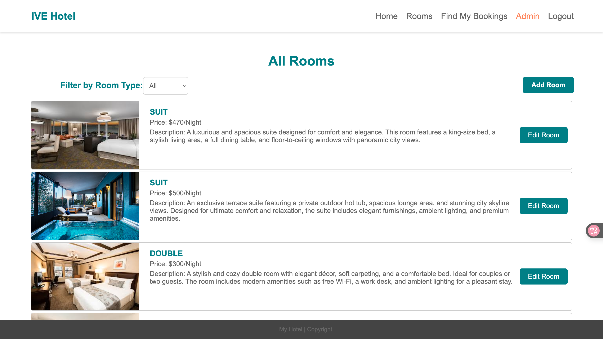
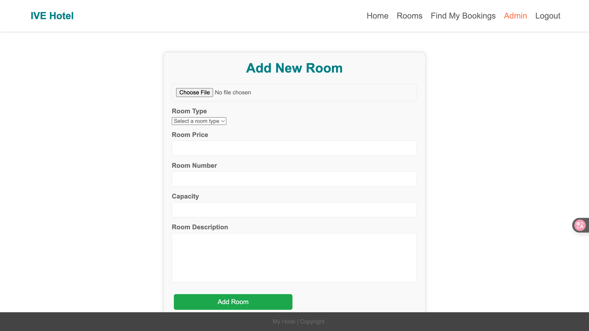
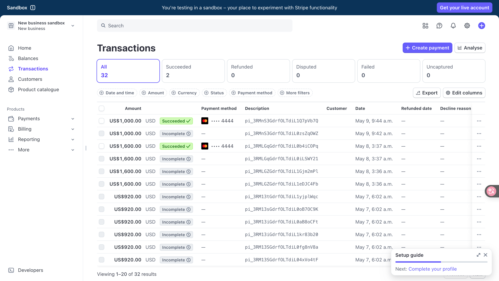

# 🏨 Hotel Booking Platform

## 📌 Overview

This is a full-stack hotel booking platform built with **Spring Boot** and **React**. It allows users to register, browse available rooms, book hotel stays, and make payments via Stripe. Admins can manage rooms and view all bookings. The platform includes authentication, authorization, and email notifications.

---

## 🧰 Tech Stack

### 🎨 Frontend
- React
- React Router
- Axios
- Tailwind CSS / Bootstrap

### 🧱 Backend
- Spring Boot 3
- Spring Security
- Spring Data JPA
- JavaMailSender
- Stripe API

### 🛢️ Database
- MySQL 8+

### 🔐 Security
- JWT Authentication
- Role-based Authorization (User / Admin)

---

## 🗂️ Project Structure

Hotel-Booking-System
- backend/ # Spring Boot application
- frontend/ # React frontend
- screenshot/ # Screenshots of the project

---

## ⚙️ Getting Started

### ✅ Prerequisites

- Node.js + npm
- Java 17+
- Maven
- MySQL 8+

### 🔧 Backend Setup

cd backend
Edit your application.properties file to match your MySQL config:

- spring.datasource.url=jdbc:mysql://localhost:3306/hotel_booking
- spring.datasource.username=your_db_username
- spring.datasource.password=your_db_password
- spring.jpa.hibernate.ddl-auto=update

### 💻 Frontend Setup
cd frontend
npm install
npm start
Runs at: http://localhost:3000

## 🔐 API Endpoints (Postman Tested)
Here’s a categorized list of available endpoints in API:

### 🔐 Auth Endpoints

| Method | Endpoint         | Description             |
|--------|------------------|-------------------------|
| POST   | /auth/register   | Register a new user     |
| POST   | /auth/login      | Authenticate user       |

---

### 👤 User Endpoints

| Method | Endpoint                    | Description                  |
|--------|-----------------------------|------------------------------|
| GET    | /users/getAllUsers          | Admin: View all users        |
| PUT    | /users/updateUser           | Update current user          |
| DELETE | /users/deleteuser           | Delete user                  |
| GET    | /users/getAcountDetails     | Get user profile details     |
| GET    | /users/getBookingHistories  | Get user's booking history   |

---

### 🛏️ Room Endpoints

| Method | Endpoint                 | Description                     |
|--------|--------------------------|---------------------------------|
| POST   | /rooms/addRoom           | Admin: Add new room             |
| PUT    | /rooms/updateRoom        | Admin: Update room info         |
| GET    | /rooms/getAllRooms       | Get list of all rooms           |
| GET    | /rooms/getRoombyId       | Get room details by ID          |
| DELETE | /rooms/deleteById        | Admin: Delete room by ID        |
| GET    | /rooms/avaliableRoom     | Get all available rooms         |
| GET    | /rooms/roomType          | Get all room types              |
| GET    | /rooms/searchRoom        | Search room by name/type/etc.   |

---

### 📆 Booking Endpoints

| Method | Endpoint                      | Description                         |
|--------|-------------------------------|-------------------------------------|
| POST   | /bookings/createBooking       | Create a new booking                |
| GET    | /bookings/getAllBookings      | Admin: Get all bookings             |
| GET    | /bookings/findByReferenceNo   | Find booking by reference number    |
| PUT    | /bookings/updateBooking       | Update existing booking             |

## 🖼️ Screenshots
You can find all screenshots in the screenshot/ folder. Example:

## 🧠 Future Enhancements

⏳ PDF invoice generation

## 👨‍💻 Author
📧 Contact: qss1774@outlook.com
